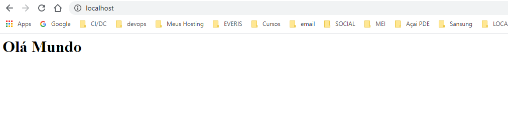
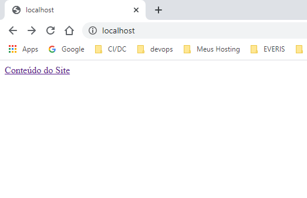
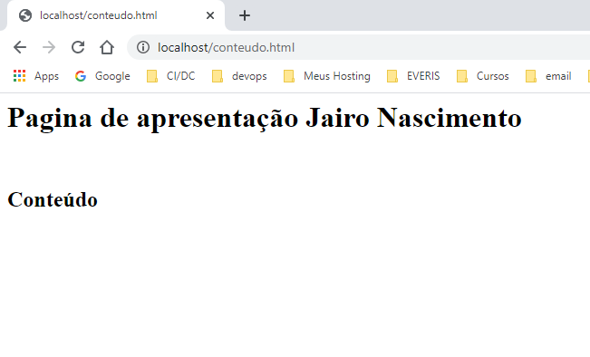

# Primeiro **Build**

* Vamos criar um **Descritor**, para isso vamos acessar um editor de sua preferência, *exemplo:* *VS Code*, *NotePad++* *etc..*

* Crie diretorio onde vai guardar o arquivo e crie o arquivo `Dockerfile`, *exemplo:* `/primeiro-build/Dockerfile`.

> ⚠️ O arquivo tem ter esse nome `Dockerfile` começa com `"D"` maiusculo o `"f"` minusculo e não tem extenção.


* FROM &rarr; é basicamento onde você quer basear sua image a partir de outra image.

* RUN &rarr; executa comandos.
* \> &rarr; direciona para um diretorio do arquivo

```text
# conteudo arquivo Dockerfile

FROM nginx:latest
RUN echo '<h1> Olá Mundo</h1>' > /usr/share/nginx/html/index.html

```

* Dentro do diretorio onde criou o arquivo descritor abra o terminal.

```bash
$ primeiro-build> docker image build -t ex-simple-build .
```
* `-t`  &rarr; comando para dar o nome (tag) a imagem.

* **`.`**  &rarr; indica o arquivo esta no mesmo diretorio do terminal.

* Execute o comando:

```bash
$ primeiro-build> docker image build -t ex-simple-build .
Sending build context to Docker daemon  2.048kB
Step 1/2 : FROM nginx:latest
latest: Pulling from library/nginx
d121f8d1c412: Pull complete
ebd81fc8c071: Pull complete
655316c160af: Pull complete
d15953c0e0f8: Pull complete
2ee525c5c3cc: Pull complete
Digest: sha256:9a1f8ed9e2273e8b3bbcd2e200024adac624c2e5c9b1d420988809f5c0c41a5e
Status: Downloaded newer image for nginx:latest
 ---> 7e4d58f0e5f3
Step 2/2 : RUN echo '<h1> Olá Mundo</h1>' > /usr/share/nginx/html/index.html
 ---> Running in 73e405ba671d
Removing intermediate container 73e405ba671d
 ---> 2218581f0fa9
Successfully built 2218581f0fa9
Successfully tagged ex-simple-build:latest
SECURITY WARNING: You are building a Docker image from Windows against a non-Windows Docker host. All files and directories added to build context will have '-rwxr-xr-x' permissions. It is recommended to double check and reset permissions for sensitive files and directories.

$ primeiro-build>
```

* Verificar se realmente realmente a imagem foi criada:

```bash
$ primeiro-build> docker image ls
ex-simple-build     latest              2218581f0fa9        4 minutes ago       133MB
nginx               latest              7e4d58f0e5f3        3 days ago          133MB

```

* Agora executar o container a partir dessa imagem:

```bash
$ primeiro-build> docker container run -p 80:80  ex-simple-build

/docker-entrypoint.sh: /docker-entrypoint.d/ is not empty, will attempt to perform configuration
/docker-entrypoint.sh: Looking for shell scripts in /docker-entrypoint.d/
/docker-entrypoint.sh: Launching /docker-entrypoint.d/10-listen-on-ipv6-by-default.sh
10-listen-on-ipv6-by-default.sh: Getting the checksum of /etc/nginx/conf.d/default.conf
10-listen-on-ipv6-by-default.sh: Enabled listen on IPv6 in /etc/nginx/conf.d/default.conf
/docker-entrypoint.sh: Launching /docker-entrypoint.d/20-envsubst-on-templates.sh
/docker-entrypoint.sh: Configuration complete; ready for start up
```

> O comando `-p 80:80` por default o servidor do nginx funciona na porta 80, então esse comando transporta tudo esta rodando no container nessa porta para ser utilizadas na porta 80 externo.

* Agora é só verificar no browser



# Uso das Instruções de Preparação

* Vamor criar um novo **Dockerfile** com a capacidade de receber parâmetro na hora de criação da image, vamos passar argumentos para que possa deizar alguns pontos de personalização na hora de gerar essa image.
* Crie novo diretorio com arquivo **Dockerfile**, insira o conteúdo abaixo:

```Text
FROM debian
LABEL maintainer 'Jairo Nascimento'

ARG S3_BUCKET=files
ENV S3_BUCKET=${S3_BUCKET}
```
LABEL &rarr; é variavel de personalização onde pode colocar o nome do autor do arquivo.

ARG &rarr; onde voce define o argumento que vai passar para image.

ENV &rarr; onde é definido a variavéis de anbiente para image é utilizado `${}` para definir qual argumeto que passar.

```bash
$ build-com-arg> docker image build -t ex-build-arg .

Step 1/4 : FROM debian
latest: Pulling from library/debian
57df1a1f1ad8: Pull complete
Digest: sha256:f744ed553780b84bf376fbfe7879de9a3aece6e611af110f95ca26188cf85cb6
Status: Downloaded newer image for debian:latest
 ---> f6dcff9b59af
Step 2/4 : LABEL maintainer 'Jairo Nascimento'
 ---> Running in 804e24a166bb
Removing intermediate container 804e24a166bb
 ---> 3c59a79314b3
Step 3/4 : ARG S3_BUCKET=files
 ---> Running in 6f7a9ad45652
Removing intermediate container 6f7a9ad45652
 ---> 4762caecbbfe
Step 4/4 : ENV S3_BUCKET=${S3_BUCKET}
 ---> Running in 9c1374d79d7d
Removing intermediate container 9c1374d79d7d
 ---> 4e197a47eb18
Successfully built 4e197a47eb18
Successfully tagged ex-build-arg:latest
SECURITY WARNING: You are building a Docker image from Windows against a non-Windows Docker host. All files and directories added to build context will have '-rwxr-xr-x' permissions. It is recommended to double check and reset permissions for sensitive files and directories.
```
* Criado a image com argumento, para testar que foi criado, rode o container passando o comando `bash -c` vai utilizar o terminal e seguida `echo $S#_BUCKET`

```bash
$ build-com-arg> docker container run ex-build-arg bash -c 'echo $S3_BUCKET'
files
```
Mostra o valor padrão passado no arquivo construtor.

* Agora se quiser gerar nova image passando um novo valor para variavel:

```bash
$ build-com-arg> docker image build --build-arg S3_BUCKET=myapp -t ex-build-arg .

Sending build context to Docker daemon  2.048kB
Step 1/4 : FROM debian
 ---> f6dcff9b59af
Step 2/4 : LABEL maintainer 'Jairo Nascimento'
 ---> Using cache
 ---> 3c59a79314b3
Step 3/4 : ARG S3_BUCKET=files
 ---> Using cache
 ---> 4762caecbbfe
Step 4/4 : ENV S3_BUCKET=${S3_BUCKET}
 ---> Running in ecc707ecf642
Removing intermediate container ecc707ecf642
 ---> 653f244ef06f
Successfully built 653f244ef06f
Successfully tagged ex-build-arg:latest
SECURITY WARNING: You are building a Docker image from Windows against a non-Windows Docker host. All files and directories added to build context will have '-rwxr-xr-x' permissions. It is recommended to double check and reset permissions for sensitive files and directories.
```

* Agora você executa novamente o comando para rodar o container:
```bash
$ build-com-arg> docker container run ex-build-arg bash -c 'echo $S3_BUCKET'
myapp
```
Com esses comando conseguimos passar argumentos que posso marcar dentro do **Dockerfile** 
que são pontos de personalização que na hora de criar image você pode passar esses argumentos, para criar image especificas para cada argumen to que queira personalizar.

* Temos outra forma de utilizar o `inspect` podemos fazer como fosse filtro em cima do arquivo que o `inspect` gera, veja o exemplo:

```bash
$ build-com-arg> docker inspect --format="{{index .Config.Labels.maintainer}}" ex-build-arg
Jairo Nascimento
```

# Uso das Instruções de Povoamento

* Nesse caso passar arquivos para de sua máquina Host para dentro do container, o procedimento é mesmo criar arquivo `Dockerfile`em um diretório.

* Agora crie um arquivo `index.html` com seguintes conteúdo:

```text
    <a href="conteudo.html">Conteúdo do Site</a>
```

* Nesse caso vamos copiar esse arquivo para dentro do container ele possui um link para um a página `conteudo.html`que será criado no arquivo construtor.

* No arquivo `Dockerfile` insira as seguintes instruções:

```text
FROM nginx:latest
LABEL maintainer 'Jairo Nascimento'

RUN echo '<h1>Pagina de apresentação Jairo Nascimento</h1><br><h2>Conteúdo</h2>' > /usr/share/nginx/html/conteudo.html
COPY *.html /usr/share/nginx/html/
```

1. O comando `RUN` vai executar o um `echo` que criar o conteudo `'<h1>Pagina de apresentação Jairo Nascimento</h1><br><h2>Conteúdo</h2>'` dentro do arquivo no diretorio passado depois operador `>` no caso `/usr/share/nginx/html/conteudo.html`

2. O comando `COPY` vai copiar todo arquivo com extensão `*.html` que esteja dentro do diretório do arquivo, para dentro do diretorio `/usr/share/nginx/html/` no container.

* No terminal execute o comando para gerar a **IMAGE**, lembrando é dentro do diretório onde foi criado o `Dockerfile`

```bash
$ build-com-copy> docker image build -t ex-build-copy .
```

* Agora excute o container, mapeando a porta 80 do container para sua porta 80 host.

```bash
$ build-com-copy> docker container run -p 80:80 ex-build-copy
```

* Agora é só conferir no browser.

 


