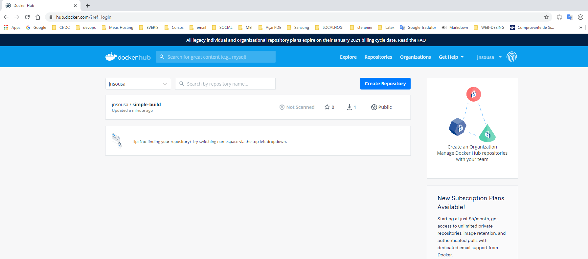

# Enviar Image para docker hub

## 1 - Introdução

você pode guardar suas imagem para repositório Docker Hub

* Verifica as imagem repositorio local

```console
> docker image ls 
```

* criar Tag na image escolhida com o usuario cadastrado no Docker Hub

```bash
> docker image tag <nome image> jnsousa/<nome><versão>
```
Exemplo:

```bash
> docker image tag ex-simple-build jnsousa/simple-build:1.0
```

* Antes de fazer um push temos que logar no Docker Hub

```bash
> docker login --username=jnsousa
```

```bash
> docker login --username=jnsousa
Password:
Login Succeeded 
```

* Agora podemos fazer o push da imagem criada

```bash
> docker image push <nome da imagem a ser enviada>
```
Exemplo:

```bash
> docker image push jnsousa/simple-build:1.0

The push refers to repository [docker.io/jnsousa/simple-build]
36a7b9aa1dc5: Pushed
908cf8238301: Mounted from library/nginx
eabfa4cd2d12: Mounted from library/nginx
60c688e8765e: Mounted from library/nginx
f431d0917d41: Mounted from library/nginx
07cab4339852: Mounted from library/nginx
1.0: digest: sha256:e93b2cb9c58f7823adc3d6f323e7e8aaa87ed7653ed085a7696758c327f73e75 size: 1569
PS E:\workspace\Udemy\cod3r\Curso-de-Docker\primeiro-build>
```

* Agora podemos conferir no repositorio remoto




[voltar página principal](https://jairosousa.github.io/Curso-de-Docker)