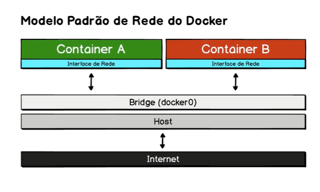
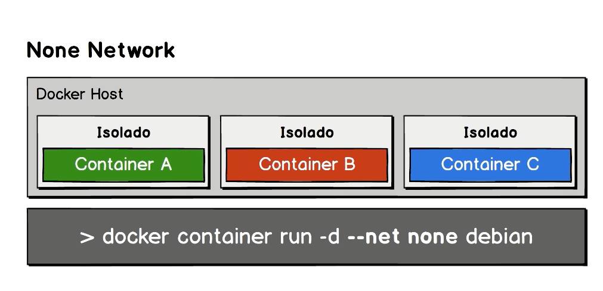
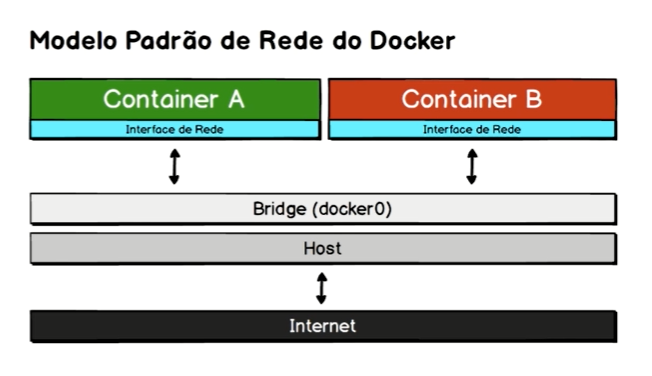

# Redes Docker

## Modelo de rede

O modelo padrão utilizado pelo docker conhecido como bridge.



## Tipos de redes

1. None Network
1. Bridge Network (Padrão)
1. Host Network
1. Overlay Network (Swarm)

```bash
> docker network ls
NETWORK ID     NAME                                DRIVER    SCOPE
40036a2873a3   bridge                              bridge    local
6cc59cdbdc39   host                                host      local
594976cbcb3f   none                                null      local
e973abe6f532   spring-webflux-essentials_default   bridge    local
```

## Rede tipo None Network

Container que não tem nenhum tinho de rede



No imagem temos Doker host com varios container e quando criamos esses containers com tipo none temos container isolados, não tem acessoss entre si e muito menos acesso ao mundo exterior eobviamente ninguem consegue acessa-lo via rede somente via terminal e vai ter acesso ao volume e locais.

Para criar conrainer: 

```bash
> docker container run -d --net none debian
```

## Rede tipo Bridge Network (Padrão)




Cada container tem sua interface, mas o modo brigge faz com que temos a camada de isolamento da rede da maquina host com a rede de cada container, tem essa ponte gerenciada pelo Docker.

Como é rede criada por padrão podemos da inspect

```bash
> docker network inspect bridge

[
    {
        "Name": "bridge",
        "Id": "40036a2873a30f6d7b529139909c536f1680e2701a7415ca3acb55ffd60cad2f",
        "Created": "2021-01-17T12:16:36.6711719Z",
        "Scope": "local",
        "Driver": "bridge",
        "EnableIPv6": false,
        "IPAM": {
            "Driver": "default",
            "Options": null,
            "Config": [
                {
                    "Subnet": "172.17.0.0/16",
                    "Gateway": "172.17.0.1"
                }
            ]
        },
        "Internal": false,
        "Attachable": false,
        "Ingress": false,
        "ConfigFrom": {
            "Network": ""
        },
        "ConfigOnly": false,
        "Containers": {},
        "Options": {
            "com.docker.network.bridge.default_bridge": "true",
            "com.docker.network.bridge.enable_icc": "true",
            "com.docker.network.bridge.enable_ip_masquerade": "true",
            "com.docker.network.bridge.host_binding_ipv4": "0.0.0.0",
            "com.docker.network.bridge.name": "docker0",
            "com.docker.network.driver.mtu": "1500"
        },
        "Labels": {}
    }
]
```

### Desafio

Agora vamos criar dois containers e vamos  que tipo de interface vai ser criado para cada um desses containers e depois vamos tentar de um container acessar o outro apartir do ping.

Crianso o primeiro container em modo diamosd e sleep para ficar em operação
```bash
> docker container run -d --name container1 alpine sleep 1000

8913a89be5e8edf4a66285b2ecbbaa0e3545084a4e80967c825eb488558568e7
```

Agora executa o container em modo interativo com o comando `ifconfig` para exibir as interfaces de rede
```bash
> docker container exec -it container1 ifconfig

eth0      Link encap:Ethernet  HWaddr 02:42:AC:11:00:02
          inet addr:172.17.0.2  Bcast:172.17.255.255  Mask:255.255.0.0
          UP BROADCAST RUNNING MULTICAST  MTU:1500  Metric:1
          RX packets:16 errors:0 dropped:0 overruns:0 frame:0
          TX packets:0 errors:0 dropped:0 overruns:0 carrier:0
          collisions:0 txqueuelen:0
          RX bytes:1312 (1.2 KiB)  TX bytes:0 (0.0 B)

lo        Link encap:Local Loopback
          inet addr:127.0.0.1  Mask:255.0.0.0
          UP LOOPBACK RUNNING  MTU:65536  Metric:1
          RX packets:0 errors:0 dropped:0 overruns:0 frame:0
          TX packets:0 errors:0 dropped:0 overruns:0 carrier:0
          collisions:0 txqueuelen:1000
          RX bytes:0 (0.0 B)  TX bytes:0 (0.0 B)
```

Agora criamos o segundo container em modo diamond 

```bash
> docker container run -d --name container2 alpine sleep 1000

f3d193b660af19b78243b85a49685e8b213e903a3c95cfe4b3cd694b76d50103
```

Agora tambem vamos executar o mesmo comando do primeiro o `ifconfig`

```bash
> docker container exec -it container2 ifconfig

eth0      Link encap:Ethernet  HWaddr 02:42:AC:11:00:03
          inet addr:172.17.0.3  Bcast:172.17.255.255  Mask:255.255.0.0
          UP BROADCAST RUNNING MULTICAST  MTU:1500  Metric:1
          RX packets:10 errors:0 dropped:0 overruns:0 frame:0
          TX packets:0 errors:0 dropped:0 overruns:0 carrier:0
          collisions:0 txqueuelen:0
          RX bytes:796 (796.0 B)  TX bytes:0 (0.0 B)

lo        Link encap:Local Loopback
          inet addr:127.0.0.1  Mask:255.0.0.0
          UP LOOPBACK RUNNING  MTU:65536  Metric:1
          RX packets:0 errors:0 dropped:0 overruns:0 frame:0
          TX packets:0 errors:0 dropped:0 overruns:0 carrier:0
          collisions:0 txqueuelen:1000
          RX bytes:0 (0.0 B)  TX bytes:0 (0.0 B)

```

Agora para testar a conectividade de maquina para outra já que elas estão na mesma rede:

```bash
> docker container exec container1 ping 172.17.0.3

PING 172.17.0.3 (172.17.0.3): 56 data bytes
64 bytes from 172.17.0.3: seq=0 ttl=64 time=0.171 ms
64 bytes from 172.17.0.3: seq=1 ttl=64 time=0.259 ms
64 bytes from 172.17.0.3: seq=2 ttl=64 time=0.149 ms
64 bytes from 172.17.0.3: seq=3 ttl=64 time=0.269 ms
64 bytes from 172.17.0.3: seq=4 ttl=64 time=0.156 ms
64 bytes from 172.17.0.3: seq=5 ttl=64 time=0.210 ms
```

Agora a partir do container1 estão pingando para container2

Tambem poder executar o mesmo comando para outro com conectividade de rede

```bash
> docker container exec container1 ping www.google.com

ING www.google.com (172.217.172.196): 56 data bytes
64 bytes from 172.217.172.196: seq=0 ttl=37 time=16.146 ms
64 bytes from 172.217.172.196: seq=1 ttl=37 time=19.728 ms
64 bytes from 172.217.172.196: seq=2 ttl=37 time=17.578 ms
64 bytes from 172.217.172.196: seq=3 ttl=37 time=19.678 ms
64 bytes from 172.217.172.196: seq=4 ttl=37 time=19.876 ms
```

Agora vamos criar nova rede, que por padrão os container criado em uotra rede não tem acesso a conteiner em outra rede.

```bash
> docker network create --driver bridge rede_nova

e30f0b9fea381d1eaad0e033a9cea799f258769435c79cb92175e6ab7c367945
```

```bash
> docker network ls

NETWORK ID     NAME                                DRIVER    SCOPE
40036a2873a3   bridge                              bridge    local
6cc59cdbdc39   host                                host      local
594976cbcb3f   none                                null      local
e30f0b9fea38   rede_nova                           bridge    local
```
```bash
> docker network inspec rede_nova

[
    {
        "Name": "rede_nova",
        "Id": "e30f0b9fea381d1eaad0e033a9cea799f258769435c79cb92175e6ab7c367945",
        "Created": "2021-01-17T14:57:50.0171655Z",
        "Scope": "local",
        "Driver": "bridge",
        "EnableIPv6": false,
        "IPAM": {
            "Driver": "default",
            "Options": {},
            "Config": [
                {
                    "Subnet": "172.18.0.0/16",
                    "Gateway": "172.18.0.1"
                }
            ]
        },
        "Internal": false,
        "Attachable": false,
        "Ingress": false,
        "ConfigFrom": {
            "Network": ""
        },
        "ConfigOnly": false,
        "Containers": {},
        "Options": {},
        "Labels": {}
    }
]
```

Agora criamos um container nessa rede

```bash
> docker container run -d --name container3 --net rede_nova alpine sleep 1000

f9c187949743a5c6ecdf759f398ceee17f1d66ab89d4c7910966fd4a67beb72c
```

```bash
> docker container exec -it container3 ifconfig

eth0      Link encap:Ethernet  HWaddr 02:42:AC:12:00:02
          inet addr:172.18.0.2  Bcast:172.18.255.255  Mask:255.255.0.0
          UP BROADCAST RUNNING MULTICAST  MTU:1500  Metric:1
          RX packets:15 errors:0 dropped:0 overruns:0 frame:0
          TX packets:0 errors:0 dropped:0 overruns:0 carrier:0
          collisions:0 txqueuelen:0
          RX bytes:1242 (1.2 KiB)  TX bytes:0 (0.0 B)

lo        Link encap:Local Loopback
          inet addr:127.0.0.1  Mask:255.0.0.0
          UP LOOPBACK RUNNING  MTU:65536  Metric:1
          RX packets:0 errors:0 dropped:0 overruns:0 frame:0
          TX packets:0 errors:0 dropped:0 overruns:0 carrier:0
          collisions:0 txqueuelen:1000
          RX bytes:0 (0.0 B)  TX bytes:0 (0.0 B)
```

Agora vamos tentar ping a parti do container3 para container1

```bash
> docker container exec -it container3 ping 172.17.0.2

PING 172.17.0.2 (172.17.0.2): 56 data bytes
^C
--- 172.17.0.2 ping statistics ---
136 packets transmitted, 0 packets received, 100% packet loss
```

Repare não consegue pingar por ser duas redes independentes e não foi feito nenhum tipo de configuração para ter conectividade entre essas redes


Agora vamos configurar o container3 para se comunicar com a rede bridge.

```bash
> docker network connect bridge container3
```

```bash
> docker container exec -it container3 ifconfig
```


[voltar página principal](https://jairosousa.github.io/Curso-de-Docker)