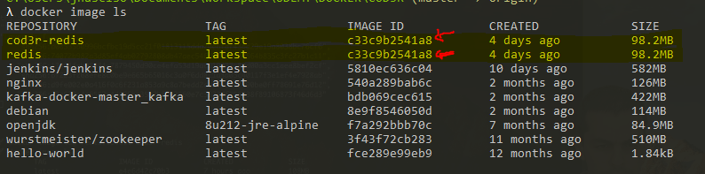

# Deixando de ser Apenas um Usuário

## 1 - Introdução

Agora vamos deixar de ser usuário e vamos começar a criar as nossas próprias imagens.

## 2 - Diferenças entre container e imagem

Isso tem estar bem claro, qualquer coisa revise o capitulo de [Introdução](./introducao.md).

### ⚠️ O comando `docker container --help` você tem acesso a todos os subcomando de container.

```bash
$ docker container --help

Usage:  docker container COMMAND

Manage containers

Commands:
  attach      Attach local standard input, output, and error streams to a running container
  commit      Create a new image from a container's changes
  cp          Copy files/folders between a container and the local filesystem
  create      Create a new container
  diff        Inspect changes to files or directories on a container's filesystem
  exec        Run a command in a running container
  export      Export a container's filesystem as a tar archive
  inspect     Display detailed information on one or more containers
  kill        Kill one or more running containers
  logs        Fetch the logs of a container
  ls          List containers
  pause       Pause all processes within one or more containers
  port        List port mappings or a specific mapping for the container
  prune       Remove all stopped containers
  rename      Rename a container
  restart     Restart one or more containers
  rm          Remove one or more containers
  run         Run a command in a new container
  start       Start one or more stopped containers
  stats       Display a live stream of container(s) resource usage statistics
  stop        Stop one or more running containers
  top         Display the running processes of a container
  unpause     Unpause all processes within one or more containers
  update      Update configuration of one or more containers
  wait        Block until one or more containers stop, then print their exit codes

Run 'docker container COMMAND --help' for more information on a command.
```

### ⚠️ O comando `docker image --help` você tem acesso a todos os subcomando das imagens.

```bash
$ docker image --help

Usage:  docker image COMMAND

Manage images

Commands:
  build       Build an image from a Dockerfile
  history     Show the history of an image
  import      Import the contents from a tarball to create a filesystem image
  inspect     Display detailed information on one or more images
  load        Load an image from a tar archive or STDIN
  ls          List images
  prune       Remove unused images
  pull        Pull an image or a repository from a registry
  push        Push an image or a repository to a registry
  rm          Remove one or more images
  save        Save one or more images to a tar archive (streamed to STDOUT by default)
  tag         Create a tag TARGET_IMAGE that refers to SOURCE_IMAGE

Run 'docker image COMMAND --help' for more information on a command.
```

### ⚠️ O comando `docker volume --help` você tem acesso a todos os subcomando dos volumes.

```console
> docker volume --help

Usage:  docker volume COMMAND

Manage volumes

Commands:
  create      Create a volume
  inspect     Display detailed information on one or more volumes
  ls          List volumes
  prune       Remove all unused local volumes
  rm          Remove one or more volumes

Run 'docker volume COMMAND --help' for more information on a command.
```

## 3 - Entendendo melhor as imagens

As nossas imagens são organizadas em ***Registry*** O [**Docker Hub**](https://github.com/jairosousa/Curso-de-Docker.git) é o mais famoso dele.

```bash
# Comando para baixar uma imagem
$ docker image pull
```
### Vamos baixar uma imagem do Docker Hub para memoria maquina.

```bash
# Baixar a ultima versão do Redis (latest)
$ docker image pull redis:latest

latest: Pulling from library/redis
8ec398bc0356: Pull complete
da01136793fa: Pull complete
cf1486a2c0b8: Pull complete
188200a8c82e: Pull complete
9391ca24f5d0: Pull complete
6ed21f46fa2d: Pull complete
Digest: sha256:21b037b4f6964887bb12fd8d72d06c7ab1f231a58781b6ca2ceee0febfeb0d36
Status: Downloaded newer image for redis:latest
docker.io/library/redis:latest
> 
```

```bash
$ docker image ls

REPOSITORY                  TAG                 IMAGE ID            CREATED             SIZE
redis                       latest              c33c9b2541a8        4 days ago          98.2MB
jenkins/jenkins             latest              5810ec636c04        10 days ago         582MB
nginx                       latest              540a289bab6c        2 months ago        126MB
kafka-docker-master_kafka   latest              bdb069cec615        2 months ago        422MB
debian                      latest              8e9f8546050d        2 months ago        114MB
openjdk                     8u212-jre-alpine    f7a292bbb70c        7 months ago        84.9MB
wurstmeister/zookeeper      latest              3f43f72cb283        11 months ago       510MB
hello-world                 latest              fce289e99eb9        12 months ago       1.84kB
```

### Agora você pode perceber que nos temos redis na ulti ma versão acamos de baixar

### Podemos inspecionar essa imagem:

```bash
$ docker image inspect redis:latest
[
    {
        "Id": "sha256:c33c9b2541a8fea04fe621e1e9d4e5973d9062f2a4eaac7a8d8b82c23c1b0aa8",
        "RepoTags": [
            "redis:latest"
        ],
        "RepoDigests": [
            "redis@sha256:21b037b4f6964887bb12fd8d72d06c7ab1f231a58781b6ca2ceee0febfeb0d36"
        ],
    ---
]
```

### Nos podemos criar uma nova **TAG** para essa imagem

```console
> docker image tag redis:latest cod3r-redis
```

###Executar novamente o comando **ls**

```console
> docker image ls

REPOSITORY                  TAG                 IMAGE ID            CREATED             SIZE
cod3r-redis                 latest              c33c9b2541a8        4 days ago          98.2MB
redis                       latest              c33c9b2541a8        4 days ago          98.2MB
jenkins/jenkins             latest              5810ec636c04        10 days ago         582MB
nginx                       latest              540a289bab6c        2 months ago        126MB
kafka-docker-master_kafka   latest              bdb069cec615        2 months ago        422MB
debian                      latest              8e9f8546050d        2 months ago        114MB
openjdk                     8u212-jre-alpine    f7a292bbb70c        7 months ago        84.9MB
wurstmeister/zookeeper      latest              3f43f72cb283        11 months ago       510MB
hello-world                 latest              fce289e99eb9        12 months ago       1.84kB
```

### Repare que alem de ter redis na ultima latest temos tambem o cod3r-redis e perceba que temos o mesmo hash (ID) gerado.



### Agora podemos excluir as duas imagems

```bash
$ docker image rm redis:latest cod3r-redis

Untagged: redis:latest
Untagged: redis@sha256:21b037b4f6964887bb12fd8d72d06c7ab1f231a58781b6ca2ceee0febfeb0d36
Untagged: cod3r-redis:latest
Deleted: sha256:c33c9b2541a8fea04fe621e1e9d4e5973d9062f2a4eaac7a8d8b82c23c1b0aa8
Deleted: sha256:f848356c08033001312164ad23108497adde2432bdcd2a119dbfa8dcfea0cb13
Deleted: sha256:a4f3d75a03456a2b5f8f81892db93c08ec2eff54ae6b339a9191804cf484b863
Deleted: sha256:f8ad3d1bccd2b246988576bbbec5f0f079c2690e6e3d670338450a6d866612cc
Deleted: sha256:c80de70938af062d3c273f9925641ec672fe182a796bb4a096a37963c92e071a
Deleted: sha256:e807dfe0532b9dae274911841bab81588e9e34591a5b809b8da39471fb75fdbd
Deleted: sha256:556c5fb0d91b726083a8ce42e2faaed99f11bc68d3f70e2c7bbce87e7e0b3e10
```


> 💡 As **Tags** são pointeiros para imagem especificas,  via de regra não é interessante apontar para última versão sempre, pois você oode ter sistema estavel e um software pode sofrer atualização. O Ideal e ter versão especificas.

# Comandos Básicos no Gerenciamento de Imagens

* Todos os comando começão com `docker image`

```bash
# Pull
$ docker image pull 
```
* É o comando responsavel de baixar uma imagem direto do **Docker HUB**
* Muitas vesez ele acontece de modo implicito, isto é, você não precisa diretamente chamar o `docker pull`.

> Exemplo: Você chama o comando `docker run` e o docker percebe que não tem a imagem no seu registry local (*sua máquina*) ele automaticamente chama o `docker image pull` para baixar essa imagem.

```bash
# ls
$ docker image ls 
```
* serve para listar imagens

```bash
# rm
$ docker image rm <nome tag>ou <hash>
```
* serve para remover image, depois do comando você acrescenta o nome da *tag* ou varias separadas por espaço ou pode usar o *hash* ou sequencia deles.

```bash
# inspect
$ docker image inspect <nome tag>ou <hash>
```
* Image que você queira inspecionar vai te mostrar um documento em formato `json` com várias informações importante sobre a imagem.

```bash
# tag
$ docker image tag <imagem de origem> <nome da tag que você quer colocar>
```
* Nesse você passa dois parâmetros?
  * Primeiro a imagem de origem fonte onde quer aplicar uma tag.
  * Segundo você passa o nome da tag de fato e você quer colocar.


```bash
# buid
$ docker image build
```
* Você pega um arquivo descritor do docker ele vai interpletar esse arquivo ele vai contruir sua image vai gerar.

```bash
# push
$ docker image build
```

* Uma vez que você cria uma image da um `build` nessa image você pode publicar ou no registry local ou no registry do Git Hub

# Docher Hub x Docker Registry

* **Registry** é um serviço server side para registro e obtenção de image, é serviço que te disponibiliza uma *api* para que possa enviar  e resgatar image apartir desse serviço. Você pode por exemplo pegar um registry instalar na sua empresa ter um registry privado para image especificar que você quer criar dentro da empresa.

* **Docker Hub** é um ***SAS*** (*Software As Service*) é um produto na nuvem disponibilizado pelo **Docker** ele dentro do **Docker Hub** existe um **Registry** que você possa registar suas imagens. **Docker Hub** é maior possue o **Registry** dentro dele, possui uma interface grafica, tem outras coisa que o **Registry** normal não tem.
  * Exemplo dentro **Docker Hub** tem várias imagens oficiais, essas imagens oficiais são geradas pelo time do prório **Docker** eles que mantem essas imagens.


[voltar página principal](https://github.com/jairosousa/Curso-de-Docker)